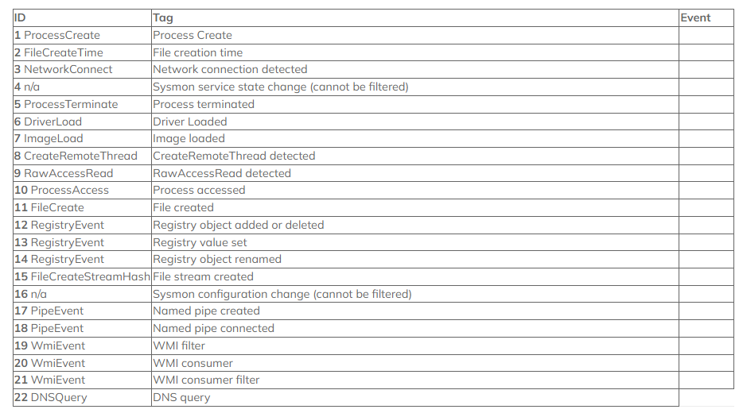

# Content-Analysis

- Rule Snort, Surikata

- `Redteam References:`
  - https://atomicredteam.io/atomics/
  - https://book.hacktricks.xyz/welcome/readme
  - https://www.ired.team/offensive-security/code-injection-process-injection/process-injection
  - https://redcanary.com/threat-detection-report/techniques/modify-registry/
  - https://github.com/redcanaryco/atomic-red-team
  - https://atomicredteam.io/atomics/#impact
  - https://gtfobins.github.io

## [0] Knowledge:

- MITRE ATT&CK Fundamentals, Sysmon Log Basic, Windows Event Log.
- [Learn sysinternal](https://www.youtube.com/watch?v=fCp2usRXmGg) .
- [PowerShell Script to Connect Multiple Server's Remote Session](https://www.youtube.com/watch?v=zaSxFqLTf0s&t=124s) .
- [Powershell Svcript learn Microsoft](https://learn.microsoft.com/en-us/training/modules/script-with-powershell/2-introduction-scripting) .
- [Sample write rule Sigma](https://www.nextron-systems.com/2018/02/10/write-sigma-rules/) .

## [1] EventLogs

- Sysmonlog
  - [Download Sysmon64.exe - Sysinternal](https://learn.microsoft.com/en-us/sysinternals/downloads/sysmon) .
  - [File sysmon-config.xml](https://github.com/SwiftOnSecurity/sysmon-config) .
  - https://docs.logpoint.com/docs/windows/en/latest/Configurationofsources.html
  - `Sysmon struct-field` => [Setup struct-field in EventViewer | config.xml](https://rootdse.org/posts/understanding-sysmon-events/#event-id-10-processaccess') .
  ```powershell
  ./Sysmon64.exe -accepteula -i sysmonconfig-export.xml
  ```
  - Sysmon config - ID logs:
    - `1.` Process creation: ID-1
    - `2.` Network connection: ID-3 (Only UDP/TCP)
    - `3.` DLL Loaded: ID-7
    - `4.` Process Hollowing: ID-8
    - `5.` Process Access: ID-10
    - `6.` File Created ID-11
    - `7.` Registry Key ID-12/13/14
    - `8.` Alternate Data streams ID-15
    - `9.` DNS Events ID-22
      
- Windows EventLogs:

  - Event Viewer: View logs PowerShell Commands

  ```powershell
  Open the Local Group Policy Editor/Computer Configuration/Administrative Templates/Windows Components/Windows PowerShell/Turn on PowerShell Script Block Logging.
  ```

  - PowerShell default disable run script `Set-ExecutionPolicy Unrestricted` .
    - `Restricted:` No Powershell scripts can be run => This is the default setting.
    - `AllSigned:` Scripts can be run, but all must have a digital signature => Even if you wrote the script yourself on the local computer.
    - `RemoteSigned` Locally-written scripts can be run => But scripts from outside (email, IM, Internet) must be signed by a trusted publisher.
    - `Unrestricted:` Any script will run => Regardless of who created them or whether they are signed.

- Linux EventLogs:
  - Event Logs in Linux `/var/log` .
